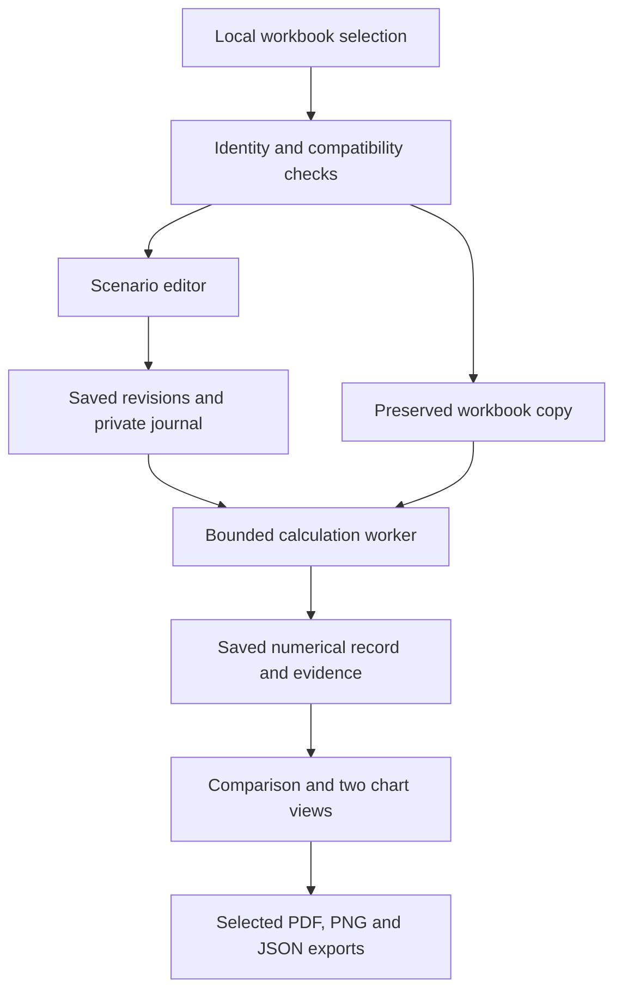

# Application architecture

The application runs on one computer. A loopback-only HTTP service serves the bundled browser page; workbook intake, scenario persistence, calculations and chart exports run locally. There is no required application account, hosted upload or telemetry service.

The diagram describes the application route, not a completed network/security audit. Installation downloads public dependencies. Operating-system services, the browser and other software on the computer have their own network behaviour.

## Boundaries

| Component | Responsibility |
| --- | --- |
| `workbooks.py` | Bound and inspect workbook packages, identify bytes, read supported layout and caches |
| `scenarios.py` | Normalize complete customized inputs and financing terms |
| `engine.py` and semantic adapter | Calculate selected workbook dependencies and attach explicit evidence |
| `store.py` | Preserve revisions and reasoning, migrate the known schema, save per-workbook outward context, validate identities and refuse stale runs |
| `chart_context.py` | Validate explicit outward text and its full source/revision binding |
| `app.py` and `web.html` | Local interaction, request checks, immutable upload copies and selected export fields |
| `worker.py` | Foreground calculation with parent-liveness and deadline checks |
| `charts.py` | Two presentation views over the same saved numerical record; no recalculation |

The original source workbook is not overwritten. Runtime data and diagnostic records belong outside source and package directories. A saved revision binds its workbook and complete inputs; a worker completing after an edit cannot attach its result to the new revision. Chart view and saved context-label changes do not change calculations. Comparison/export reads the saved context and numerical records from the same database snapshot and checks the client’s expected source and context revision. No label is inferred from an internal filename or journal.

Chart text (legend labels plus heading) is saved through one store transaction so that a refused heading or a concurrent change cannot leave a partially applied set of labels. The parent application serializes calculation requests and enforces a deadline. The worker adds its own lifetime checks. These controls have a bounded foreground-worker scope; they are not a general process supervisor or a guarantee against an uninterruptible operating-system failure. Windows behaviour requires separate execution tests.

## Developer orientation

Run the focused component tests from the reviewed source with the declared dependencies installed. Test fixtures in the source must be synthetic and non-sensitive. Real workbook numerical receipts are separate evidence bound to exact source identities; do not commit private workbooks, workspaces, screenshots or logs as fixtures.

Before changing numerical behaviour, identify the supported input/output contract and preserve tolerances, error classes, baseline/comparator semantics and source provenance. A green interface test does not establish numerical correctness. Before changing export fields, test both intended content and exclusion of private labels, journal entries and paths.

See the [data contract](data-contract.md) for schema limits and [exchange/recovery guide](exchange-recovery.md) for backups. Public release requires a reviewed source inventory, dependency/asset rights, reproducible installation and independent acceptance; building a package alone does not establish readiness.

## Start developing from the installed source

1. Follow [installation](installation.md), including a noneditable install into a dedicated environment. Keep data outside the source tree.
2. Run `python -m lic_dsf.app --help` and verify the imported package path with `python -c "import lic_dsf; print(lic_dsf.__file__)"`.
3. From the source root, run `python -m unittest discover -s tests -v`. With Node.js installed, run `node tests/example_definitions.js` and `node tests/presets.js`. These JavaScript files are synthetic source/handler checks; neither launches a browser or calculates a workbook.
4. Run [the public tutorial](tutorial.md) against the installed package in a new data directory. Reinstall after source edits and restart before checking the installed behavior.

The package entry point `lic-dsf-scenario-tool` calls `lic_dsf.app:main`; `python -m lic_dsf.app` is the equivalent module route used in this guide. `web.html` is bundled as package data. The source distribution also includes documentation and schemas via `MANIFEST.in`; a wheel contains the runtime package, so retain the source documentation alongside it.

## Follow a change through the code

| Change | Begin here | Preserve or verify |
| --- | --- | --- |
| Supported workbook geometry | `ida21.py`, `workbooks.py` | Row labels, year mapping, cached values and explicit refusal of unsupported geometry |
| Scenario definitions | `scenarios.py`, `contracts.py` | Complete finite paths, canonical units and financing relations |
| Numerical behavior | `engine.py`, `excel_semantics.py` | Probe scope, first divergence, exact error classes and absolute tolerance `1e-6` |
| Shared explanations | `rationale.py`, `store.py` | Revision binding, integrity and separation from private journals |
| Comparison | `compare.py`, `store.py` | One workbook, current runs, explicit comparator and separate baseline channels |
| Browser workflow | `web.html`, `app.py` | Unsaved edits, current calculation state, paired previews and download contents |
| Chart export | `charts.py`, `chart_context.py` | Same saved numerical record, valid outward text, evidence on every page |
| Workspace persistence | `store.py` | Preserved old records, supported migrations and recoverable backups |

`schemas/scenario-v1.schema.json` describes numerical inputs. Comparison v3 adds outward labels, context and shared explanations around saved numerical records. These are versioned export contracts, not a stable third-party HTTP API promise or a scenario import interface. Application requests include a local session token and explicit workbook/context revision checks.

A code test, an installed browser test and an Excel comparison answer different questions. Preserve separate receipts for each. Review [contribution guidance](../CONTRIBUTING.md) and [publication boundaries](privacy-and-publication.md) before distributing a change.

[Documentation index](README.md)
