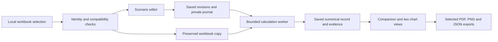

# Application architecture

The application runs on one computer. A loopback-only HTTP service serves the bundled browser page; workbook intake, scenario persistence, calculations and chart exports run locally. There is no required application account, hosted upload or telemetry service.

The diagram describes the application route, not a completed network/security audit. Installation downloads public dependencies. Operating-system services, the browser and other software on the computer have their own network behaviour.

## Boundaries

| Component | Responsibility |
| --- | --- |
| `workbooks.py` | Bound and inspect workbook packages, identify bytes, read supported layout and caches |
| `scenarios.py` | Normalize complete customized inputs and financing terms |
| `engine.py` and semantic adapter | Calculate selected workbook dependencies and attach explicit evidence |
| `store.py` | Preserve revisions and reasoning, migrate the known schema, save per-workbook outward context, validate identities and refuse stale runs |
| `chart_context.py` | Validate explicit outward text and its full source/revision binding |
| `app.py` and `web.html` | Local interaction, request checks, immutable upload copies and selected export fields |
| `worker.py` | Foreground calculation with parent-liveness and deadline checks |
| `charts.py` | Two presentation views over the same saved numerical record; no recalculation |

The original source workbook is not overwritten. Runtime data and diagnostic records belong outside source and package directories. A saved revision binds its workbook and complete inputs; a worker completing after an edit cannot attach its result to the new revision. Chart view and saved context-label changes do not change calculations. Comparison/export reads the saved context and numerical records from the same database snapshot and checks the client’s expected source and context revision. No label is inferred from an internal filename or journal.

The parent application serializes calculation requests and enforces a deadline. The worker adds its own lifetime checks. These controls have a bounded foreground-worker scope; they are not a general process supervisor or a guarantee against an uninterruptible operating-system failure. Windows behaviour requires separate execution tests.

## Developer orientation

Run the focused component tests from the reviewed source with the declared dependencies installed. Test fixtures in the source must be synthetic and non-sensitive. Real workbook numerical receipts are separate evidence bound to exact source identities; do not commit private workbooks, workspaces, screenshots or logs as fixtures.

Before changing numerical behaviour, identify the supported input/output contract and preserve tolerances, error classes, baseline/comparator semantics and source provenance. A green interface test does not establish numerical correctness. Before changing export fields, test both intended content and exclusion of private labels, journal entries and paths.

See the data contract for schema limits and the privacy/recovery guide for local retention and backup. Public release requires a reviewed source inventory, dependency/asset rights, reproducible installation and independent acceptance; building a package alone does not establish readiness.
