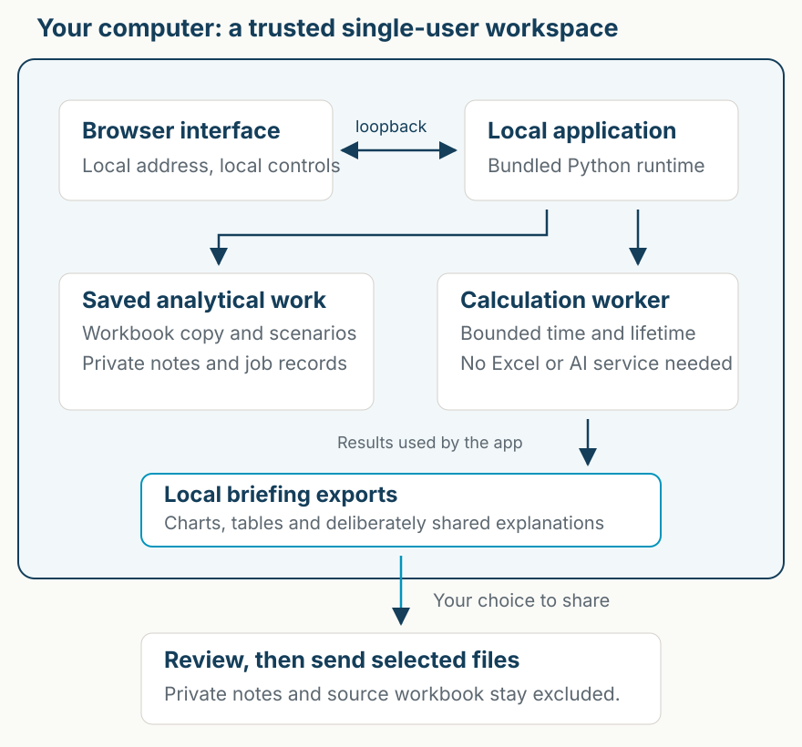

# Information for IT departments

The LIC-DSF Scenario Analysis Tool is an MIT-licensed local application for comparing alternative macroeconomic and financing assumptions in a supported debt-sustainability workbook. It saves scenarios and produces charts, reports and underlying data. It does not use AI inference or send workbooks to a hosted calculator.

**Version scope: `0.1.0a2`.** At package assembly, Windows execution, downloaded Mac approval and a complete desktop walkthrough were unverified. The [release evidence](release-notes-0.1.0a2.md#release-evidence) explains how to check later results for the exact archive. This is information for an institution's assessment, not a security certification or a claim of universal policy compliance. Consult the release's asset fingerprints and evidence before evaluating a download. Source checks, package inspection and actual desktop execution are distinct evidence; the limitations below remain relevant.

For this version, forward this page or use your browser's print-to-PDF function. See the [release notes](release-notes-0.1.0a2.md) for package scope and evidence limits. The two-page PDF attached to alpha.1 describes that earlier release; it is not the IT summary for alpha.2.

## At a glance

| Question | Answer |
| --- | --- |
| Publisher and source | Teal Insights; [public source repository](https://github.com/Teal-Insights/lic-dsf-scenario-tool) |
| Intended environment | A trusted single-user desktop. No public proxy, shared server or untrusted concurrent local users/processes. |
| Runtime | Bundled CPython and pinned dependencies; the interface opens in the default browser. No Python or Excel installation is needed for desktop-package calculations. |
| Privileges | Extraction and execution under the user's account; no administrator installer, system service or scheduled task is part of the package. Institutional application controls may still restrict execution. |
| Local listener | HTTP on `127.0.0.1`, an operating-system-selected port. The launcher prints/opens the address. |
| Signing | First Mac wrapper is unsigned and unnotarized; Windows launcher is an unsigned script. No publisher-signing or universal SmartScreen/Gatekeeper acceptance claim. |
| Updates and support | Manual release replacement, best-effort support, no guaranteed response time or automatic updater. |

The [installation guide](installation.md) gives extraction, startup, stopping and removal instructions. Technical users can inspect or install the [source](source-installation.md). This page is designed to be forwarded directly; IT consultation is not an extra application onboarding step for every user.

## Data flow and storage

The diagram shows the local analytical workflow. A separate, user-triggered input route downloads the fixed official example from the World Bank over HTTPS and verifies its exact size and fingerprint before retaining a local copy. The publisher receives ordinary connection metadata; no analytical workbook, scenario inputs, results or notes are included in that request. A verified cached copy is reused without a new publisher download. See the network table below for this boundary and the limits of its test evidence.

The selected original workbook is preserved. The app stores a separate copy, saved assumptions, revisions, private journals, calculation requests/results and worker logs in the workspace. Browser-only unsaved edits can be lost. Exported files go to the browser's download location or a location the user chooses.

| Platform | Application data location |
| --- | --- |
| Windows | `%LOCALAPPDATA%\Teal Insights\LIC-DSF Scenario Tool\workspace` |
| Mac | `~/Library/Application Support/Teal Insights/LIC-DSF Scenario Tool/workspace` |

Adjacent cache directories hold plotting/runtime caches; a calculation lock coordinates work. The application provides no workspace encryption, remote wipe or secure erasure. Operating-system permissions, disk encryption, backups, cloud-folder sync and endpoint controls remain relevant. A folder labelled local may still be synced or backed up by other software.

Briefing packets deliberately contain numerical assumptions, results, selected labels and shared explanations. They exclude the original workbook, private journals and internal workspace names. A user can nevertheless type confidential information into a shared explanation. Review before sending. A scenario file contains reusable inputs for the exact same workbook; a private backup contains substantially more data. See [privacy and recovery](privacy-recovery.md).

## Processes and local access

The Mac app opens Terminal and starts its bundled interpreter; the Windows command launcher starts its bundled interpreter in a command window. The Python application serves the browser interface and starts one bounded calculation worker. Worker requests, results and errors use explicit UTF-8 encoding. The worker has a parent/lifetime guard and a calculation deadline capped at ten minutes.

The service binds to loopback and checks Host, request Origin and a per-run token. It sends no-store, content-security and anti-framing headers. These protect parts of the browser-request boundary. **They do not authenticate operating-system users.** Any process that can reach the computer's loopback service can obtain the boot token and call its APIs, including a process under another local account. Do not use this alpha on a shared host with untrusted concurrent local users or processes.

The app's workspace is separate from the software bundle. The launchers verify package files and calculation identity before starting. These integrity checks detect missing or changed files against the accompanying inventory; if an attacker can replace both payload and inventory, they do not independently prove publisher authenticity. Verify the release source and published archive fingerprint as separate checks.

## Workbook handling

The supported file is an `.xlsx` or `.xlsm` ZIP package. Browser uploads are limited to 25 MiB. The lower-level intake independently checks the compressed size (32 MiB), expanded size (256 MiB), member size (64 MiB), member count (4,000), compression ratio and member paths. It refuses encrypted entries and links. Declaration-aware XML parsing rejects DTDs and entities across encodings and part names before downstream workbook reading.

Workbook intake does not execute VBA or refresh external workbook links. The evaluator implements a bounded supported formula/geometry profile, not every Excel feature. Original files and numerical evidence remain distinct. See [methods](methodology.md), [input contracts](workbooks-inputs-outputs.md) and [verification](verification.md).

## Network behavior and dependencies

Alpha.2 adds the one-click example route. Its verified cache supports reuse without another publisher download; the three teaching-case definitions are bundled locally. Alpha.2 requires its own source and package checks. Representative offline analysis and observation of connected outbound traffic remain separate evidence work. The table describes the application's behavior, not a completed network audit. Cached workbooks remain outside the application archive.

| Activity | Network use and boundary |
| --- | --- |
| Get the desktop package | Browser connects to GitHub and its release-asset delivery infrastructure. |
| Get the reference workbook | On the built-in example action, the local app downloads the pinned HTTPS World Bank file, checks its identity and caches it. No private workbook or scenario inputs are sent. The publisher sees ordinary connection information, such as IP address. The workbook is not bundled. Older builds use the browser download route. |
| Install from source | Python tooling fetches the pinned evaluator from GitHub and dependencies from package repositories. The desktop ZIP avoids this installation step. |
| Use the local interface | Browser connects to loopback. Interface fonts and chart resources are bundled. |
| Calculate and export | Local Python processing; no hosted calculation API or telemetry service is required by the application. |
| Follow help links or send feedback | The user deliberately opens external documentation/GitHub/World Bank/IMF links or an email application. |

These statements describe the application and intended workflow. Browser extensions, operating-system services, cloud sync and endpoint software have their own network behavior. Representative offline analysis and observation of connected outbound attempts, including errors and diagnostics, remain distinct acceptance evidence. Do not interpret the table as an unconditional no-egress guarantee.

A 13 September 2026 `pip-audit` 2.10.1 query of the PyPI vulnerability service reported no known vulnerabilities for the 22 pinned Python dependency versions inspected across the two package runtimes. It queried public names and versions, not workbook contents. That finding is time-limited and does not cover all bundled native libraries, unknown vulnerabilities, the correctness of the evaluator's pinned source revision or the application itself. Inspect the [machine-readable advisory lookup](dependency-audit.json). Dependency/license inventories and exact package integrity remain separate checks.

## What has and has not been tested

A prior application build completed a Windows Server 2022 x64, Administrator-account pilot with Python 3.13.15 and no Excel. It exercised startup, workbook upload, two calculations, both chart views, packet download, scenario re-import and restart. Its 1,212 comparison fields agreed with a Mac reference within the fixed `1e-6` tolerance. This is not final-alpha, ordinary-user or managed Windows 11 laptop acceptance.

The Mac packaging work uses Apple Silicon and a fresh relocatable CPython 3.11.16 runtime. Its selected NumPy dependency requires macOS 14 or later. Intel Mac and older macOS coverage are not claimed. Final downloaded/quarantined Finder launch is a separate check from a local terminal calculation.

The alpha.2 source checks and their limits are listed in [verification](verification.md). Rebuilt artifacts require independent review. Desktop launch checks were unverified at package assembly; later results must identify the tested archive. Earlier locale and XML intake regressions reproduced failures before their fixes. This is bounded testing, not penetration testing, WCAG certification, formal DPG recognition or independent fresh Excel verification. [Platform status](accessibility-platforms.md) records historical evidence separately.

## Updates, removal and reporting

Stop the application with Control-C, make a private backup and review release notes before updating. Extract the new package separately; do not mix files or run two versions against the same workspace. The package installs no background service or automatic updater. Removing the app leaves analytical data intact; deliberate data removal and backups need separate attention.

Use [private vulnerability reporting](../SECURITY.md) for suspected security problems. Teal Insights owns triage on a best-effort basis without a guaranteed response time. Do not put private workbooks, logs, credentials or exploit details into public issues. General feedback goes to [lte@tealinsights.com](mailto:lte@tealinsights.com).

If institutional controls block execution, use the approved review or software-distribution process. We do not ask users to disable endpoint protection, remove quarantine or bypass organisational controls.
