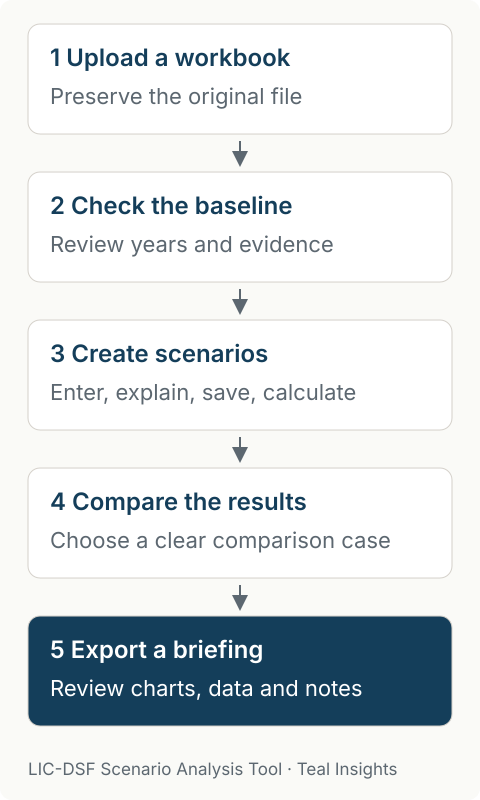

Explore how different macroeconomic and financing assumptions affect debt indicators in your LIC-DSF workbook. Save alternatives, explain your reasoning, compare the results and prepare a briefing with charts and underlying data.

**Early-stage preview.** We are developing this tool iteratively and welcome co-design with ministries of finance, international financial institutions and other stakeholders. It is not an official IMF or World Bank product. Fresh Microsoft Excel verification remains pending.

## Start with a worked example

[Download and install](user-guide/installation.qmd), then follow the [illustrative walkthrough](user-guide/tutorial.qmd) using the official illustrative workbook. The next walkthrough is available in the 0.1.0a2 source candidate; alpha.2 desktop bundles are pending. Published alpha.1 downloads predate the built-in teaching route.

The workflow keeps your source workbook and separate scenario assumptions together, so you can review what changed before sharing results.

{width=480}

## Find the guide you need

| What you want to do | Where to go |
| --- | --- |
| Understand what the tool does and its limits | [Methods and evidence](user-guide/methodology.qmd) |
| Read and reuse exported charts and data | [Read a briefing packet](user-guide/reading-briefing.qmd) |
| Understand local data handling and installation | [Information for IT departments](user-guide/it-review.qmd) |
| Save work or share scenario assumptions | [Exchange and recovery](user-guide/exchange-recovery.qmd) |
| Inspect verification and its limits | [Reproduce the checks](user-guide/verification.qmd) |
| Review our DPG assessment | [Evidence and remaining work](user-guide/dpg-evidence.qmd) |
| Inspect the code interface | [API reference](reference/index.qmd) |
| Report a problem or suggest an improvement | [Help shape the tool](user-guide/feedback.qmd) |

The application evaluates supported workbook formulas locally. It does not use AI inference or random sampling to calculate results. Read the [methodology](user-guide/methodology.qmd) before interpreting them.

## Help shape the next version

Tell us what you tried, what worked and what needs to change. [Send feedback to lte@tealinsights.com](mailto:lte@tealinsights.com?subject=LIC-DSF%20Scenario%20Tool%20preview%20feedback). Please leave confidential workbooks and analytical data out of your message.

The software is free to use, copy and improve under the [MIT license](license.qmd). The World Bank template and third-party assets have their own rights and terms.
